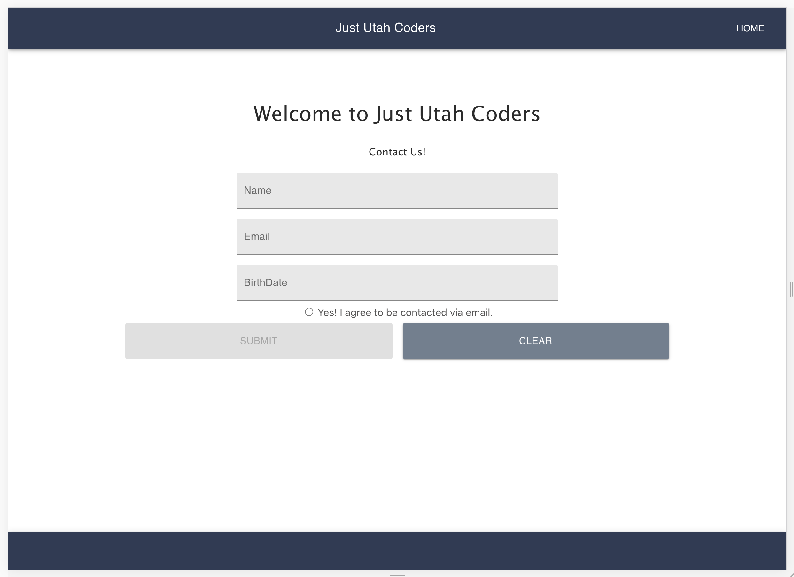
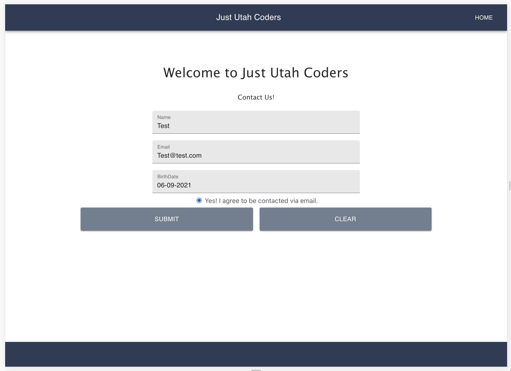
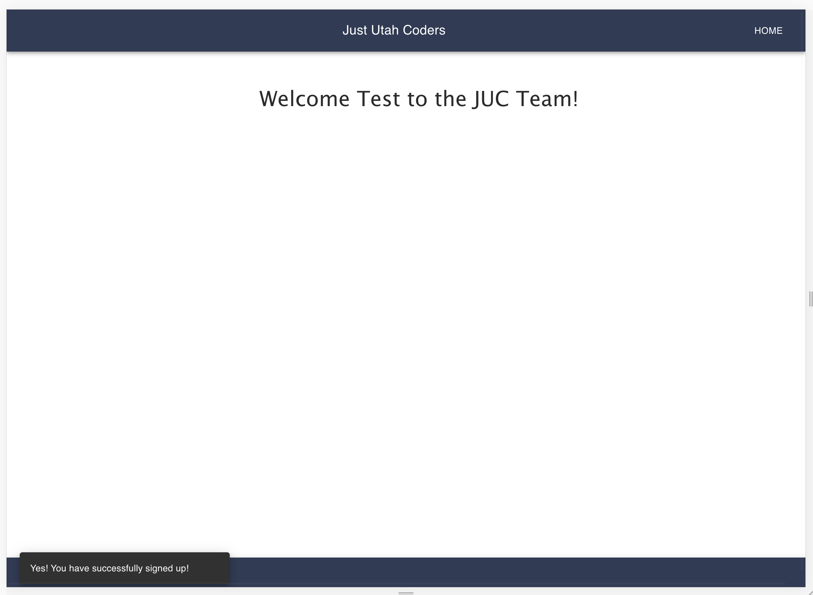

## Welcome!  JUC - Internship Technical Interview - New Participant Intake Form

This is React web app that allows users to input their name, email, birthdate, and email consent to receive email communication from Just Utah Coders.  

To Install:
    npm i
    npm start

## Back-end API

https://my-json-server.typicode.com/JustUtahCoders/interview-users-api/users 

[
{
"id": 1,
"name": "Test User",
"email": "Post 1",
"birthDate": "2000-01-01",
"emailConsent": true
}
]

## Screenshots

## Dependencies

### Install react router dom
    [] npm install react-router-dom

    import {
    BrowserRouter as Router,
    Switch,
    Route,
    Link
    } from "react-router-dom";

### Install Material UI
    [] npm install @material-ui/core
    [] npm install @material-ui/icons

### Install Greensock 
    - used for animations
    []  npm install gsap

    import { gsap } from "gsap";

### Axios
    [] npm install axios

    import axios from 'axios';

### Install Notinstack

  https://github.com/iamhosseindhv/notistack

  [] npm install notistack

  import { SnackbarProvider } from 'notistack';

### Install Yup - form validation

    https://www.npmjs.com/package/yup

    [] npm install -S yup

### npm install dateformat

    [] npm install dateformat

    - This is an npm package that formats date.

    https://www.npmjs.com/package/dateformat

